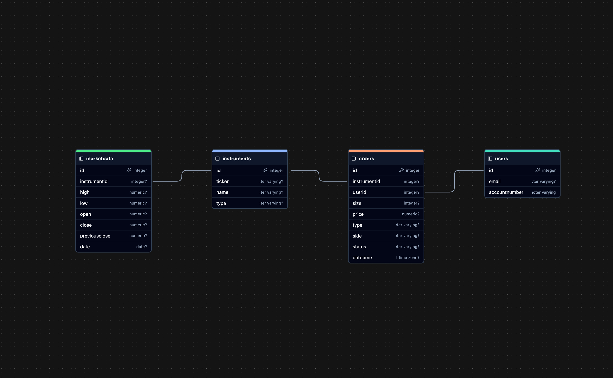

## Description

This project is built with [NestJS](https://nestjs.com), [TypeORM](https://typeorm.io), and [PostgreSQL](https://www.postgresql.org). It uses a Dockerized environment with `docker-compose` for seamless deployment and includes integration with `.env` files to manage configuration for development and testing.

## Features

- Server-side application using NestJS
- Database management with PostgreSQL via TypeORM
- Environment-ready configuration using `.env`
- Unit and integration tests
- Dockerized setup for local development and testing
- Documented endpoints in Swagger

## Project setup use Azure DB

```bash
# Install dependencies
$ npm install

# Start in development mode
$ npm run start:dev
```

## Project setup with Docker (local database credentials)

```bash
# Docker compose
$ docker-compose up --build
```

## Running tests (with Azure DB)
```bash
# Run unit tests
$ npm run test
```

## Swagger API Documentation

The API documentation is available via [Swagger](http://localhost:3000/api-docs)

## Database Diagram

Below is the database schema used for this project:

